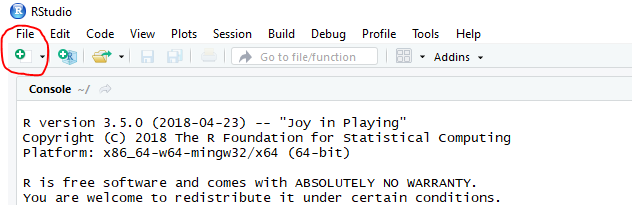
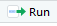
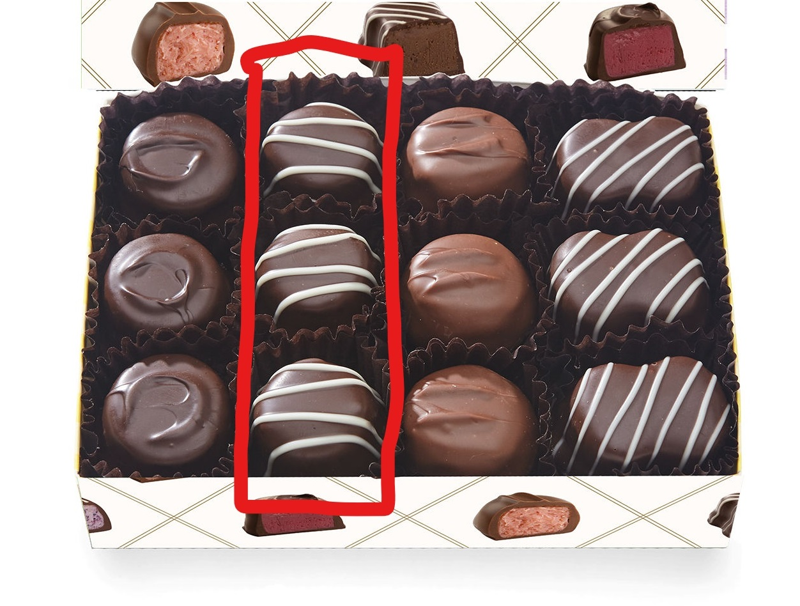
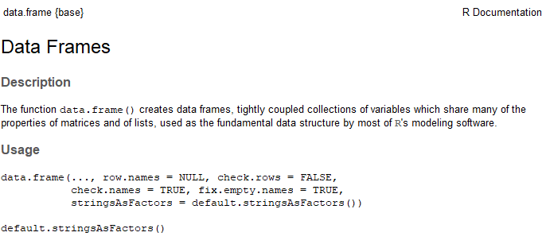
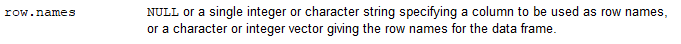

```{r setup, include=FALSE}
options(htmltools.dir.version = FALSE)
```

# Tonights Goals

- For those of you new to R:
  - Given a very high level introduction to R
  - Get excited to learn more
  
- For you intermediate to advanced Folk:
  - Tonight's data set can be found [github.com/fivethirtyeight/data/blob/master/births/US_births_2000-2014_SSA.csv](http://www.github.com/fivethirtyeight/data/blob/master/births/US_births_2000-2014_SSA.csv)
      - Come up with a visualization, and post to to Twitter, with link to your code
          - '#SeattleRUsers'
      - Flex those R skills, maybe try something new
      - Potentially see a technique you haven't used before


- Inspire the start of a more regular meetup schedule

---

#Ellis Hughes
.pull-left[
- Statistical Genetics Programmer
      - 3.5 Years programming in R
      - Create specialty and general R packages that we use internally
      - Support team of biostatisticians working in genetics
      
- Programming for 6 years
      - MATLAB while performing research

- Connect with Me:
      - linkedin.com/in/ellishughes
      - Twitter - @ellis_hughes
]

.pull-right[
.center[]
]

---
# Getting Started

- Install the latest version of R onto your computer from R-project.org at: [https://cloud.r-project.org/](https://cloud.r-project.org/).

- To make things easier, download the RStudio IDE from Rstudio at : [https://www.rstudio.com/products/rstudio/download/#download](https://www.rstudio.com/products/rstudio/download/#download)

--

- Once everything is downloaded, open RStudio
    - open a new script by either:
        - cntrl+shift+n
        - click the new script button
        
.center[]
    
---

#Programming

- Programming is sending sets of instructions for your computer to complete
- Instructions are sent to your computer one line at a time
    - in R, a line is run by
        - either cliking the "Run" button 
        - ctrl + enter

- You can tell R to ignore a line using the "#" symbol
```{r, eval=FALSE}
#This is a comment
this is not a comment and R will attempt to run it
```
   
- Comments are useful because then you can write notes to yourself
    - I suggest using them to take notes during this presentation in your new R script

---

#What in the world is an R?

- A statistical computing language, based off of S
    - R. Gentleman and R. Ihaka, 1993

- Has a large and active community

- Incredibly flexible language
    - Scripting
    - Web Applications (Shiny)
    - Reproducible Reports (Knitr)
    - Presentations
    
- This entire presentation was created using R, Rmarkdown, and the package [Xaringan](https://github.com/yihui/xaringan)


---
# Object Oriented

- Think of an object as a box
   - individually it has its own size and has specific contents
   - There are types of boxes with specific properties and behaviors
   
- Object have properties known as "class"
  - different box types
    - can have different items
    - speeds of delivery
  
  
```{r Objects, eval=FALSE}

TRUE #LOGICALS (BOOLEAN) - a true or false value

1 # INTEGER - A number with no decimals

1.1 # NUMERIC - A number with the ability to have decimals 

"HELLO WORLD" #CHARACTER (STRING) - words or numbers within quotes 

```

---

# Variable Assignment

- Value assignment to variables is done through '<-'

- To continue the box metaphore
    - Like writing "kitchen stuff" on a box
    - you can change the name of the box, but the contents don't change

```{r ObjectsAssignment}
sampleObject<-TRUE #TRUE or FALSE
```

###You try
In your console, create an object named sampleObject, and assign the number 42 to it. then type 'sampleObject' into the console and press enter on your keyboard


--

```{r you_try_1}

sampleObject<-42
sampleObject

```

---

# Objects in Objects

### The next object level up are
  - Vectors, Matrices and Data.frames
      - Stores multiple low level objects as one
      
  - Box Metaphore:
      - More complicated boxes, that hold the smaller boxes within them

---

##Vector

- Vectors hold other objects
  - in a single Dimension 
    - think of a skinny box that can only hold a single line of boxes
  - Objects with in the vector are of the same type
  - created with the 'c' function

```{r Objects_in_Objects_Vectors}

VECTORS_LOGICAL<-c(TRUE,TRUE,FALSE) 

VECTORS_NUMERIC<-c(1,2.5,3.14159267834)
VECTORS_NUMERIC_SEQUENCE<-1:10

VECTORS_CHARACTER<-c("THIS","is","A","Character","Vector")
```

When you print a vector, it looks like this:

```{r Objects_in_Objects_Vectors_print}
VECTORS_CHARACTER
```

---
##Vector

### Now You try:

Create a vector with 5 entries, assign it to sampleVector, and print it out!

.center[
```{r, eval=FALSE}
    name<-c(...)
```
]

--

#### Example:
```{r you_try_2}
sampleVector<-c("You","can","do","this","!")
sampleVector
```

---
# Objects in Objects

|**Matrix** |**Data.frame** |
|:------|:----------|
|*All contents* must be of the same class  |*columns* must be of the same class      |
||      |


```{r Objects_in_Objects_Matrices}
MATRIX_LOGICAL<-matrix(c(TRUE,TRUE,FALSE,FALSE,TRUE,TRUE),ncol=2)
MATRIX_NUMERIC<-matrix(c(1,2,3,4,5,6,7,8,9),ncol=3)

DATA_FRAME_MIX <- data.frame(c(TRUE,TRUE,FALSE),
                         c(132.4,56.7,89),
                         c("THIS","IS A","DATA.FRAME!"))
```

---
# Objects in Objects

### Accessing Content
- To access the data stored in these objects we use "square braces": [ ]
  - inside the square brace we input a vector
  - we can access a single entry or multiple

--
  - Vectors
    - One dimension, the entry number:
```{r vector_extraction, eval=FALSE}
VECTORS_LOGICAL[1]
VECTORS_LOGICAL[c(2,3,4)]
```
--
  - Matrices and data.frames
    - Two dimensions; rows and columns

```{r matrix_extraction, eval=FALSE}
MATRIX_NUMERIC[1,1]
DATA_FRAME_MIX[1:2,]
```


---
# Objects in Objects

### Changing/Assigning Content
- Assign new values to elements of vectors, matrices and data.frames is done with "<-"
    - specify the element(s), rows, or columns you want to replace
    - use the assignment '<-' with the new values
--

- You can replace a specific entry, or an area with a value
```{r assignment_specific}
MATRIX_NUMERIC[1,]<-45
MATRIX_NUMERIC[c(2),c(2,3)]<-20
```
--
```{r assignment_print}
MATRIX_NUMERIC
```

---
# Objects in Objects

### Names
.pull-left[]
.pull-right[
- Vectors, Matrices and Data.frames can also have naming along each of their dimensions
  - Allows for easier indexing
  
- If each column of the chocolates box on the left had a name describing its contents
    - "dark_round"
    - "swirled_round"
    - "light_round"
    - "swirled_square"

```{r, eval=FALSE}
chocolate_box[,2]
chocolate_box[,"swirled_round"]
```
 ]

---
# Now You try: Square Braces

Enter the following into your console:
```{r you_try_4_setup}
set.seed(12345)
sampleDF<-data.frame(NameOne=c(1,2,3),
                     RandomValues=runif(3),
                     TestName=c("This","Column is","Named"),
                     row.names = c("Row1","test1234","Row3"))
```

1. Extract the second row of sampleDF
2. Write the number 45 to the 2nd column, 3rd row of sampleDF

.footnote[
#####Remember!
```{r, eval=FALSE}
#extraction
dataFrameObject[row Numbers/Names,column Numbers/Names]
#assigment
dataFrameObject[row Numbers/Names,column Numbers/Names]<-Value
```
]
---
# Now You try: Square Braces

### Example:

```{r you_try_4}
#1
sampleDF["test1234",] #sampleDF[2,]

#2
sampleDF[3,2]<-45 #sampleDF["Row3","RandomValues"]<-45
print(sampleDF)
```

---
# Functions

- Object of class "function"
  - Perform some sort of action based on inputs
      - each function has a specific number of inputs
        - known as arguments, each argument has a name
  - returns an object to be assigned to a variable
--

- Base R has a number of statistical and mathematic funcions built in, such as
  - standard mathematical functions (+,-,/,*)
  - functions to perform regressions
  - data import/export
  - visualization
--

- functions are used with the following format

```{r, eval=FALSE}
  outputVariable<-functionName(argument1=inputVariable,
                               argument2=inputVariable2,
                               ...)
```
---
#Functions

To find out more about a function, type 

```{r, eval=FALSE}
  ?functionName
```

into your console and press enter

--


To find out if there is a function that does what you want, there are a few options
  - type "??" and the topic into the console. Such as
```{r, eval=FALSE}
  "??regression"
```
  - go to the internet
      - google
      - Stackoverflow.com
---
# Functions

- We've been using functions to create vectors, matrices and data.frames
- for example, when we create a data.frame:

```{r function_junction_1_2}
testDF<-data.frame(var1=c(1,2,3,4,5,6),
                   var2=c(4,5,6,7,8,9),
                   var3=c("Hello","there","Stranger!","This","is","Fun!"))

```

- If we wanted to change anything about the data.frame generation, we would type '?data.frame' and get the following:



---
# Functions

- Based on that description, what if I wanted to add names to the rows of the data.frame
- there is an argument "row.names" whose description is as follows:


- Based on that description, I add an argument to my previous data.frame generation called "row.names" that is a character vector that matches the number of rows in the data.frame!

```{r , eval=FALSE}
testDF<-data.frame(var1=c(1,2,3,4,5,6),
                   var2=c(4,5,6,7,8,9),
                   var3=c("Hello","there","Stranger!",
                          "This","is","Fun!"),
                   row.names=c("row1","row2","Banana",
                               "row4","rownamehere","lastRow"))

```


---
# Now You try: Functions

Enter the following into your console:
```{r you_try_5_setup}
set.seed(12345)
sampleDF<-data.frame(c(1,2,3),
                     runif(3),
                     c(1.1,2.2,5.5))
```

- Use the 'cor' function to calculate the correlation of sampleDF using the Kendall method
    - use the '?cor'
    - You can base what you do off of this use of 'cor':
    
.center[
```{r you_try_5_setup2, eval=FALSE}
  correlations<-cor(inputDataFrame,method="spearman")
```
]

---
# Now You try: Functions

### Example:

```{r you_try_5}
cor(sampleDF, method="kendall")
```

---

# The CRAN and Packages

Functions I've shown are built into R, as in they are available from the time R is downloaded. Sometimes more advanced techniques are required.
--

  1. create entire code sets and programs for complex algorithms, keep up to date on the most recent advancements, have to debug when new versions of R come out, ensure consistency, spend time making sure function works as it should than using it  
  
--

  2. copy someones code

--

Comprehensive R Archive Network (CRAN) 
  - smart and dedicated people that enjoy writing out very useful functions
  - available for everyone
  - come with manuals called vignettes

More than likely, someone has created a package to do whatever you are trying to do. Take a quick google search to see if it does.   
- The CRAN has over 12745 at of July 10th, and grows every day.

---

# The CRAN and Packages

- install.packages()
  - downloads and installs necessary code for immediate use
--

- to use non-base R functions
  - library()

```{r cran_install, eval=FALSE}
install.packages("tidyverse")
library(tidyverse)

```

---

#Visualization

- R has graphic generation abilities built in
- the package "ggplot2"

--

- There are arguments for both in terms of control and final product quality
    - in the end, it is whichever makes the most sense to you
--

- Most of my graphics generation has been in ggplot2
- The nice features of ggplot2 include
    - layers graphics
    - easily add to a ggplot object to create different versions
    - abstracts some of the less fun parts of graphic generation
    - many geoms and scaling for logically generating your graphic

--

- install ggplot2 with install.packages("ggplot2")
- load into environment with library(ggplot2)

```{r}
#install.packages("ggplot2")
library(ggplot2)
```


---
#Visualization

###ggplot2

- all plots start with "ggplot"
```{r eval=FALSE}
gg<-ggplot()

#OR

gg<-ggplot(inputDataFrame)

```
---
#Visualization

###ggplot2

- add layers with '+'

- layers are "geoms"
    - how to plot the information 
    - geom_point, geom_line, geom_path, geom_boxplot, geom_bar, geom_hist
    
- each geom uses the function "aes"
    - aes = "aesthetic"
    - inputs to aes change based on the geom
    - to know what to use, type ?geom_XXX and read about its aethetics

```{r eval=FALSE}
inputDF<-data.frame(Col_X=c(1,2,3,4,5,6),
                  Col_Y=c(4,5,6,7,8,9))

gg<-ggplot(inputDF)+
  geom_point(aes(x=Col_X,y=Col_Y, color=factor(Col_X)))

```
---
class: center

```{r, echo=FALSE}
library(ggplot2)
inputDF<-data.frame(Col_X=c(1,2,3,4,5,6),
                  Col_Y=c(4,5,6,7,8,9))

ggplot(inputDF)+
  geom_point(aes(x=Col_X,y=Col_Y, color=Col_X))

```
---
class: center
####Adding another Layer
```{r}
library(ggplot2)

ggplot(inputDF)+
  geom_point(aes(x=Col_X,y=Col_Y, color=factor(Col_X)))+
  geom_line(aes(x=Col_Y,y=Col_X, color="red" ))

```
---
#Visualization

###ggplot2

- titles and labels can be added via ggtitle, xlab, ylab

- Can be modified with "themes" as well
    - ggplot2 comes with themes such as
        - theme_bw, theme_minimal, etx
    - there are packages that have additional themes
        - "ggthemes" is one example


```{r ,eval=FALSE}

gg<-ggplot(data.frame(Col_X=c(1,2,3,4,5,6),
                  Col_Y=c(4,5,6,7,8,9)))+
  geom_point(aes(x=Col_X,y=Col_Y, color=factor(Col_X)))+
  geom_line(aes(x=Col_Y,y=Col_X, color="red" ))+
  ggtitle("This is the Title",subtitle = "this is a subtitle")+
  xlab("Sample X Label")+
  ylab("Sample Y Label")+
  theme_minimal()

```
---
class: center
```{r ,echo=FALSE}
ggplot(data.frame(Col_X=c(1,2,3,4,5,6),
                  Col_Y=c(4,5,6,7,8,9)))+
  geom_point(aes(x=Col_X,y=Col_Y, color=factor(Col_X)))+
  geom_line(aes(x=Col_Y,y=Col_X, color="red" ))+
  ggtitle("This is the Title",subtitle = "this is a subtitle")+
  xlab("Sample X Label")+
  ylab("Sample Y Label")+
  theme_minimal()

```

---

This has been a crash course to hopefully give you some tools to start understanding how to read and write your own R code and start visualizing data. 
--
I had to skip details on a lot of what I covered to talk about everything tonight

There are additional resources all over the internet. 

  - [**datacamp.com -Introduction to R**](https://www.datacamp.com/courses/free-introduction-to-r)
  - [udacity.com - Data Analysis with R](https://www.udacity.com/course/data-analysis-with-r--ud651)

--
The R world is massive, and there is always something new to learn. I will now go though an analysis and visualization of the data set I shared earlier.

---

# Tonights  Data Set!

```{r data_import}

# read.csv reads in the csv file from our computer
# we tell it that the file has a "header", and
# to make all values that are not numeric, characters
usBirths<-read.csv("https://raw.githubusercontent.com/fivethirtyeight/data/master/births/US_births_2000-2014_SSA.csv",
                   header = TRUE,
                   stringsAsFactors = FALSE)

```

---

# Tonights Data Set

```{r}
suppressMessages(library(tidyverse))

usBirths%>%
  head(n=5)

```
      
---

# Tonights Data Set - Analysis Time

We will now start the actual analysis

First, a hypothesis: There are more births at the end of the month.

Generate summary statistics to confirm hypothesis

```{r}

usBirths_day<-usBirths%>%
  group_by(date_of_month)%>%
  summarise(BirthAverage=mean(births))

```
---

# Tonights Data Set - Analysis Time

```{r}
head(usBirths_day,n=5)
tail(usBirths_day,n=5)
```

---

# Tonights Data Set - Analysis Time

- Numbers are hard to visualize immediately
- a box plot will show me the mean and ranges of all the dates easily


```{r, eval=FALSE}

ggplot(usBirths)+
  geom_boxplot(aes(x=factor(date_of_month),y=births))+
  ggtitle("Births by Date in Month")+
  xlab("Date")+
  ylab("Births")

```
---

# Tonights Data Set - Analysis Time

.center[
```{r, echo=FALSE}
usBirths%>%
ggplot()+
  geom_boxplot(aes(x=factor(date_of_month),y=births, fill=factor(date_of_month%%2)))+
  ggtitle("Births by Date in Month")+
  xlab("Date")+
  ylab("Births")+
  theme(legend.position = "none")

```
]
---

# Tonights Data Set - Analysis Time - Insights

.center[
```{r, echo=FALSE}
usBirths%>%
  mutate(DatesOfInterest=date_of_month%in%c(1,13,31))%>%
ggplot()+
  geom_boxplot(aes(x=factor(date_of_month),y=births, fill=DatesOfInterest))+
  ggtitle("Births by Date in Month")+
  xlab("Date")+
  ylab("Births")+
  theme(legend.position = "none")

```
]

---
# Tonights Data Set 

##Future
- look at week vs weekday
- when in the year vs date
- year over year trends

---

# Thank you all so much for being here!

--

# Once again, a big thank you to Axio Research for allowing us to use this space and providing the pizza

---


